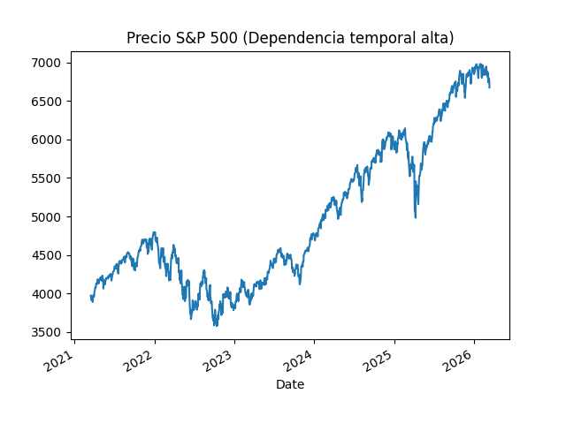
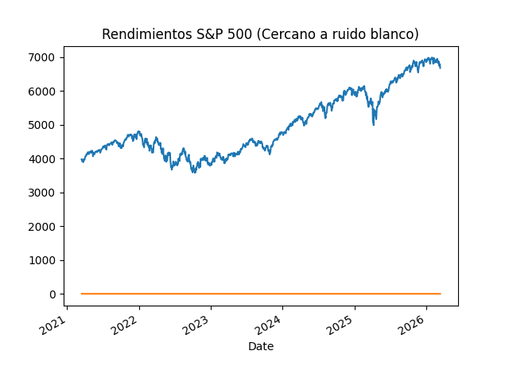

# Análisis de S&P500

En el presente proyecto analizaremos las acciones del S&P500 de los últimos 5 años, usando gráficas del comportamiento de los precios y rendimientos en base a argumentos matemáticos.

## Integrantes

- Herrera Barrera Joyce
- Góngora Ramírez Arturo

## Uso e instalación

Para leer el codigo es necesario instalar:

- `matplotlib` (se usa dentro del `main.py`)
- `yfinance` (para usar `data.py`)
- `pandas` (para manipular los datos del DataFrame)

Es necesario señalar:

- `main.py`: Contiene el código para graficar cada uno de los tres ejercicios, descarga los datos del S&P 500, genera las gráficas de precios y rendimientos.
- `data.py`: Contiene las funciones base encargadas de la extracción de datos financieros. El main ya lo importa.

Para correr el análisis completo, debe ejecutarse el comando en la terminal: `python main.py`

## Ejercicio 

Nuestro análisis de los datos de las acciones del S&P500 durante el periodo 2021-2026 es el  siguiente:

Tras visualiza el precio de las acciones del S&P500 de los últimos 5 años podemos decir que dependen del precio anterior dado que se muestra una tendencia positiva alta. Podemos ver que dado el precio alto de años pasados, el actual también lo es y eso se visualiza en la gráfica de precio.

De modo contrario, los rendimientos de las acciones del S&P500 de los últimos 5 años son independientes, no hay correlación significativa entre el rendimiento de hoy y el de ayer. No es posible predecir con precisión la dirección de los rendimientos diarios dado que son aleatorios, no siguen una tendencia a diferencia del precio. En la segunda gráfica, la línea naranja que corresponde a los rendimientos es casi plana en el eje cero. A eso se le llama proceso de ruido blanco  y establece que lo que paso en años anteriores no da pistas a lo que pueda pasar en el año actual.  

Debido a este proceso de ruido blanco, es complicado tratar de predecir los rendimientos del S&P500, por lo que no pudimos encontrar una posible respuesta.

Dentro de la inversión, consideramos que los CETES son una opción más confiable si se quieren invertir los ahorros a 1 año, aunque ambas opciones son arriesgadas, pero en el caso del S&P500 existe la probabilidad ed tener un año negativo. Es necesario considerarlo teniendo en cuenta si se quieren invertir todos los ahorros.

En caso de que la pérdida no afecta de forma sustancial del patrimonio, y aunque el año de inversión no sea favorable, es posible esperar que el mercado sea más estable o se recupere. De cualquier forma, es arriesagdo y nunca se debe invertir todo en un solo mercado. Si el plazo aumentara de 1 año a 20 años, es más rentable invertir en acciones del S&P500 debido a lo que vimos en la gráfica del precio y su tendencia positiva.

## Conclusión

En conclusión, la siguiente práctica se convirtió en un desafío de orden al no estra familiarizados con distribuir el código en partes para ejecutarlo y tratar unicamente con los datos, pero resultó más sencillo de lo que pensabamos. El análisis fue mucho más sencillo teniendo las gráficas a los datos que llegaron a ser intimidantes para nosotros en un principio. Consideramos esta práctica relevante para nuestra formación académica y profesional. Manipular y analizar estas cantidades de datos dentro de un código que arroja los resultados, nos quita la inseguridad de creer que no podemos lograrlo una vez que empezamos a trabajar en ello.

